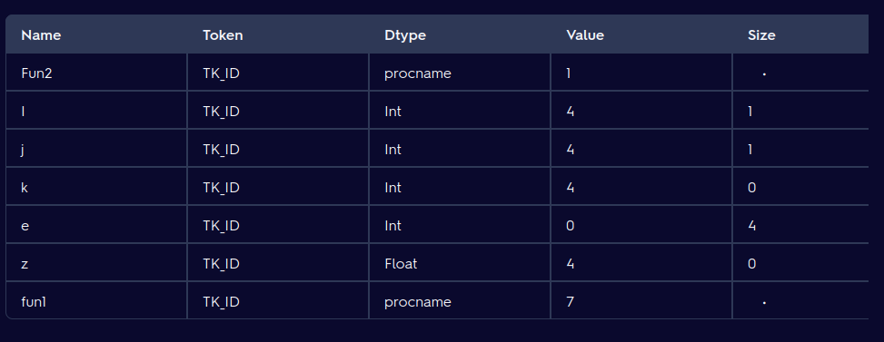

# CD notes:

## Unit 1:

### Phases of a compiler:

- Lexical analysis: scanning. breaking down source code into tokens. Lexeme matcher. Tokenisation  

- Syntax analysis: parsing, checks source code against grammatical rules of the language. Grammatical correctness.   Parse Tree vs. Syntax Tree: A parse tree is a concrete representation that retains all information from the input, while a syntax tree is an abstract representation focusing only on the necessary structure for code generation.  

- Semnatic analysis: veries statements in the code make sense in the context of the languages rules

- intermediate code generator: TAC. Bridge between high level and low level
- machine independent code optimizer: optimises intermediate code
- code generator: assembly or machine code
- machine dependent code optimizer

### Compiler variants:

- Self hosting: compile their own source code, compiler may be built with different language
- native compiler: generate code fo the same platform they are run on
- cross compilers: create executable code for different platforms

### Phases of a compiler:

- single pass: all phases in one go
- 2 pass: analysis and sysnthsis seperate
    - analysis: front end, understanding the source code
    - systhesis: backend, generates the target machine code

### Syntac analysis:

- parse tree
- recursive predictive parsing: uses a lookahead token to identify which grammar rule to use next

### Symbol Table:

- data structure that maintains records for each variable including attributes such as type, scope and storage allocation
- used during all stages of compilation
- supports multiple declarations of the same identifier
- errors related: undeclarations, mismatch in type, scope
- managed using hashing and or tree structures

### Constucting the symbol table:

- 3 operations: lookup insert and delete
- implemented using linear lists or hash tables

- Linear lists: simple to implement but inefficient when large
- Hash tables: provide better performance for lookups and insetions at the cost of increased complexity and space overhead

Example:

### Challenges in scanning:

- Syntactic sugar: code made easier to read. shortcuts that the compiler may need to expand
- Handling white spaces
- Overloaded operators
- keywords used as identifiers
- scope management

### Context free grammar:

CFG defined by (V, T, P, S)
- V = variables (non-terminals)
- T = terminals
- P = productions
- S = start variable

### Semantic Analysis:

- type checking: operations are performed on compatible types
- scope resolution: scope is correct

- Abstract Syntax tree:
    - abstacts syntax details and focuses on logical structure of the code

### Left recursive grammars:

- left recursive if it has a non terminal A such that it can derive itself forming an infinite loop
- step to remove:

A -> Aa | b

A -> bR
R -> aR | null

### Grammar trnasformations:

- Eliminating left recursion:
    - see above

- Left factoring grammar:
    - make it suitable for top down parsing by ensuring that the parser can make decisions based on the next input token
    - identify the longest common prefix 

A → α β1 | α β2 | ... | α βn | γ 

A → α A' | γ
A' → β1 | β2 | ... | βn

### Error handling:

- panic mode recovery: parser discards symbols until it finds a delimiter, prevents infinte loops
- parse level recovery: allows for logical corrections by inserting or replacing tokens for the parser to continue
- error productions: anticipates common errors by augmenting the grammar with error constructs
- global corrections: make minimal changes to the input string to correct errors but it costly in terms of time and space and is primary theoretical

### Predictive parsing and LL(1) Parsers:

- LL(1): needs to be free of left recursion, left factored
- uses a single lookahead token to make parsing decisions
- First(A): first terminals that can appear in strings derived from A
- Follow(A): set of strings that can appear immediately after A

### Error recovery in LL(1):

- error should provide a meaningful message
- panic mode recovery

## Unit 2:

### Bottom up parsing:

- from leaves to the start symbol
- aka shift reduce parsing
- LR parsing: left to right, rightmost derivation
- LR parsers handle grammars that are left recursive and not left factored
- identify substrings that match grammar and replace with non-terminals

- do with stack table

### Key concepts in bottom up parsing:

- shift-reduce parsing: parser shifts input symbols to the stackand reduces them to non terminals based on rules
- conflict resolution: conflicts appear when the parser needs to choose between shifting and reducing, resolved using lookahead tokens
- LR parsing: does not require the productions to be left factored and can have left recursion
- SLR parsing: uses follow sets to determine when to reduce
- LR(1) parsing: extension of SLR to prevent conflicts using one lookahead

### LALR Parsing:

- Look Ahead LR: more efficient for certain grammars but less powerful than LR(1)
- shift reduce conflicts avoided
- reduce reduce conflicts are present

### YACC:

- .y -> y.tab.c, y.tab.h

- contains the grammar

### Syntax directed translation: SDT

- develops syntax based on CFGs
- actions embedded in the productions

### Syntax Directied definitions: SDD

- define the semnatics of the programming language

### S-attributes and L-attributes:

- SDD is S-attributed if every attribute is synthesized, making it suitable for bottom up parsing
- S can be too restrictive
 

- L-attributed allow for inherited attributes with specific rules
- evaluated in a single left  to right pass of the parse tree

## Unit 3:

