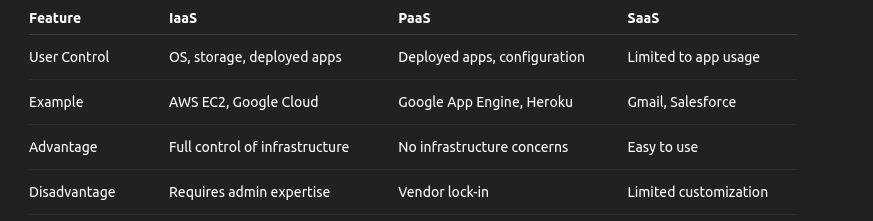
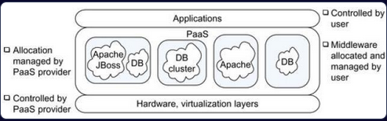
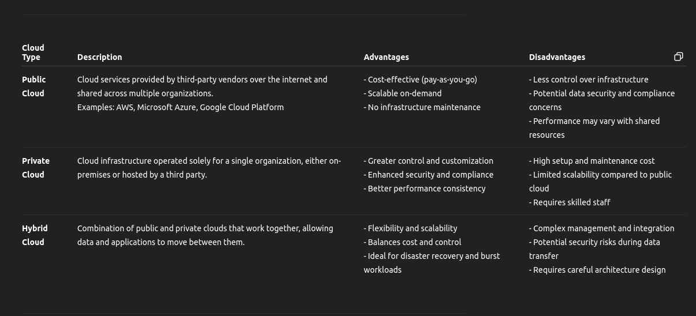
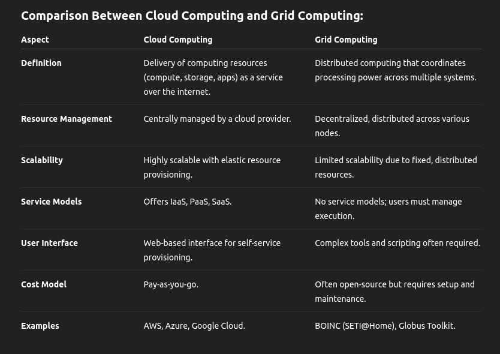

# ESA 4 markers and above possible questions:

## Unit 1:

### Conceptual Questions:

**1) Explain the essential characteristics of cloud computing**

- CC delivers cumputing resources at the internet scale, providing services and access to a pool of on-demand shared resources.
- On demand self service
- Broad network access, accecssible from various devices an locations
- Resources are pooled so serve multiple users
- saves cost  by giving resources on demand

**2) Compare and contrast IaaS, PaaS, and SaaS with suitable examples.**

**3) Describe the service models and deployment models in cloud computing.**

- Iaas:
    - Provides the hardware resources
    - User controls OS, storage

- Paas:
    - Provides platform to deploy apps and services
    - User controls the apps and configuration

- Saas:
    - Provides the full deployed software
    - User only operates the app

- Deployment models:
    - private - in house infrastructure (secure)
    - public - infrastructure open to all
    - hybrid - mix of public and private

### Application-based Questions:

**1) Discuss how cloud computing enables elasticity and scalability in enterprise applications.**

- Elasticity: Cloud computing ensures that it is able to expand as well as shrink its resource capacity on demand.
- Scalability: Cloud Computing ensures scalability by ensuring the ability to adapt quicly to changing demands while still remaining cost effective.

**2) Explain how virtualization plays a role in cloud computing. Use examples.**

- Virtualization is the process of abstracting physical resources in order to manage, organise and allocate efficiently across multiple services and systems.
- It enables services to be run machine indendent.
- It enables the system to be flexible and maintain a high utilization and isolation.
- Ex: Hypervisors like KVM, VMware Worskstation, Virtualbox.

**3) Identify challenges in adopting cloud computing in an enterprise setting. How can they be mitigated?**

- security: may be mitigated by deplying a private cloud, but may increase cost
- cost: pay on demand where resources are only billed when required
- management of resources and computationly power are made simpler and more efficient.
- vendor lock in: migrating between cloud platforms may be difficult hence the enterprise might need to only lock in on one vendor to prevent migration

### Diagram/Process Oriented Questions:

**Draw and explain the layered architecture of cloud computing.**

Ans:

 

**Explain the role of a virtual machine monitor (VMM)**

- resources abstraction and allocation
- isolation between VMs
- Control of priviliged instruction
- efficient resource utilization
- VM lifecycle management

### Case/Scenario Based:

**Given a scenario where a startup is launching a new web app, recommend a suitable cloud service model and justify your choice.**

- Paas model provides a ready to use environment with pre-configured OSes.
- It gives a faster time to market, ideal for startups
- Cost efficient as it has a pay as you go model
- It is scalable as traffic grows.

**A company needs high availability and disaster recovery. Which cloud deployment model suits them best? Justify.**

Hybrid cloud model:

- public can have a recovery backup system
- distributed computation resources over both a private and cloud system ensures very high availability even if one fails
- Critical operations stay on the private cloud due to it been very secure 

### Comparison:

**Differentiate between public, private, and hybrid clouds with advantages and disadvantages.**

**Compare cloud computing and grid computing. Which is better for a data-intensive task and why?**

Cloud computing is generally better for data-intensive tasks due to:
- Elastic Storage
- High throughput and low latency
- Build in data processing tools
- Fault tolerance and high availability

## Unit 2:

### Conceptual Questions:

**1) Explain the concept of virtualization and its significance in cloud computing.**

Ans:

- Vistualization is the process of abstracting the hardware layer such as physical resources into a logical view.
- It enables applications to operate independently of the hardware
- It is a fundamental technology in cloud computing as it facilitates resource sharing acrosss multiple servers.
- It enables VMs which allow efficient management of compute resources.
- The logical representation of resources allows for better resource allocation and management.

**2) Differentiate between Type 1 and Type 2 hypervisors with examples.**

Ans:

**Type 1 - Bare Metal**

- Type 1 hypervisors run directly on the physical hardware.
- It has better performance and efficiency.
- Manage hardware resources directly.
- Do not require a host operating system.
- Less overhead
- Strong isolation and security
- Example: Xen, Microsoft Hyper-V

**Type 2 - Hosted**

- Type 2 run on top of a host OS.
- Less performance and less efficient
- Do not manage resources directly, instead indirectly
- Requires a host OS
- More overhead
- less secure due to their reliance on the host OS
- Easy to use
- Example: VMware Workstation, Virtualbox

**3) What are the requirements of a Virtual Machine Monitor (VMM)?**

Ans:

- VMMs ensure that the virtual environment closely resembles the physical machine to maintain performance.
- Must not allow the VM to directly access the physical resources.
- Must virtualise and allocate memory and virtual memory efficiently
- Trap and translate sensitive instructions given by the VM
- Ensure that a performance close to the native resources is being achieved.

### Scenario-Based:

**1) Suppose you are deploying VMs for different OSs on the same physical hardware. Which virtualization technique will you use and why?**

- We will use Full Virtualization using a hypervisor of type 1
- Full virtualization is the complete virtualization of physical resources which allows guest OSs to run independently of each other as it removes the need for harware dependence.
- Unlike para-virtualization, it does not require the OS to be modified in any way due to the resources being completely virtualized.
- The type 1 hypervisor provides better security and isolation to each of the OS environments

### Analytical:

**1) Compare full virtualization and paravirtualization with pros and cons.**

**Full Virtualization**

- Complete simulation of the underlying hardware, allowing the guest OS to run unmodified on the hypervisor.
- Intercepts and emulates privileged instructions at runtim, which can lead to performance overhead
- Lower performance due to more overhead
- Example: Virtualbox

**Para-Virtualization**

- Presents a software interface the the VM that is similar but not identical to the underlying hardware, requires the OS to be slightly modiofied to run
- Reduces the overhead by allowing the guest OS to communicate directly with the hypervisor using hypercalls.
- Higher performance due to less overhead
- Example: KVM

**2) Explain how paravirtualization handles memory management with reference to Xen.**

- In paravirtualiztion the VM is provided with a software interface that is similar to the underlying hardware which requires the OS to be modified in order to run.
- In Xen, in order for the VM to modify the page table, it first generates a trap, which makes the page table temporary writable.
- Instead of executing priviliged memory instructions directly, the guest OS uses hypercalls to request for actions
- In Xen, the number of traps is reduced which increases the performance
- It uses virtual-to-physical mapping with the hypervisor in order to manage memory efficiently.

## Unit 3:

## Unit 4: